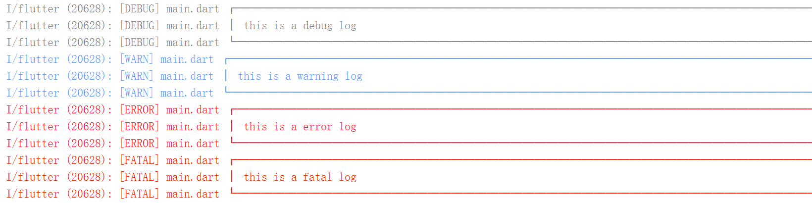
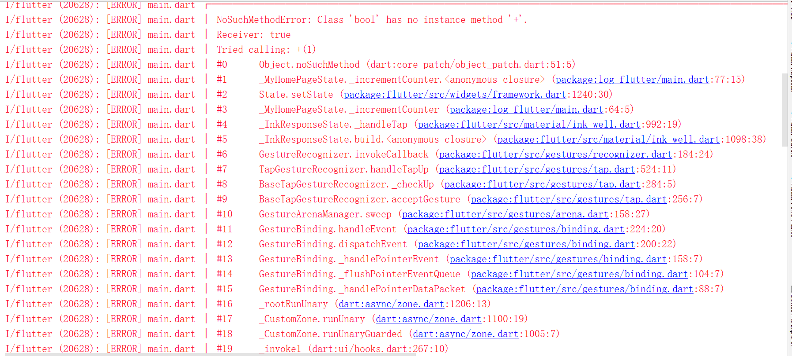
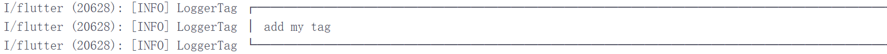
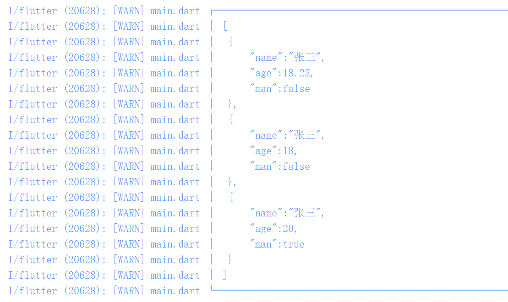
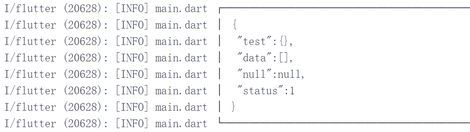

# logger

由于Android Studio Run控制台只能输出info等级的log，所以可以结合Grep Console使用。
**Example code**

## Getting Started
```dart
//控制日志输出等级
L.minLevel = LogLevel.error;

//控制日志是否输出
L.enableLog = false;

//打印各类型的log，如果不添加tag，默认添加当前文件名
L.d("this is a debug log");
L.w("this is a warning log");
L.e("this is a error log");
L.f("this is a fatal log");

//打印完整的异常日志信息，通过可选参数 'detail' 传入
try {
   dynamic result = true;
   result++;
} catch (a, e) {
   L.e(a, detail: e);
}

//添加tag，通过可选参数 'tag' 传入
L.i("add my tag", tag: "LoggerTag");

//输出json字符串，通过可选参数 'isJson' 输出json格式日志
var json1 = "[{\"name\":\"张三\",\"age\":{\"name\":\"张三\",\"age\":18}},{\"name\":\"李四\",\"age\":{\"name\":\"张三\",\"age\":18}},{\"name\":\"王五\",\"age\":{\"name\":\"张三\",\"age\":18}}]";
var json2 = "{\"data\":[{\"name\":\"张三\",\"age\":18},{\"name\":\"李四\",\"age\":20},{\"name\":\"王五\",\"age\":10}]}";
var json3 = "[{\"name\":\"张三\",\"age\":18.22, \"man\":false}, {\"name\":\"张三\",\"age\":18, \"man\":false}, {\"name\":\"张三\",\"age\":20, \"man\":true}]";
var json4 = "{\"test\":{}, \"data\":[],\"null\":null,\"status\":1}";
L.w(json1, isJson: true);
L.w(json2, isJson: true);
L.w(json3, isJson: true);
L.w(json4, isJson: true);
```
**Android Studio Run Console results**





